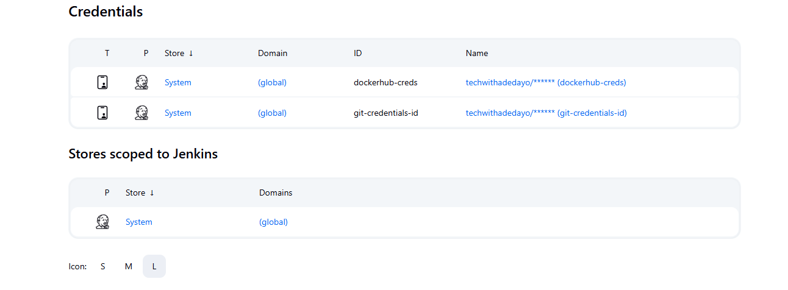

Here's a polished and easy-to-follow `README.md` guide you can share with your tutors or students, based on your current WSL (Ubuntu) and Windows setup:

---

# 🚀 Jenkins CI/CD Pipeline Setup (WSL + Windows Environment)

This guide walks you through setting up a CI/CD pipeline using **Jenkins**, **Docker**, **Minikube**, **kubectl**, and **Argo CD** in a **Windows + WSL (Ubuntu)** hybrid environment.

---

## 🛠️ Prerequisites

Ensure the following are installed on your system:

* **Windows 10/11**
* **Windows Subsystem for Linux (WSL)**
* **Ubuntu (via WSL)**
* **Docker Desktop for Windows**
* **Minikube** installed on Windows
* **kubectl** installed on Windows
* All tools should be accessible from your localhost

---

## 📦 Step 1: Install Git

Run inside **Ubuntu WSL**:

```bash
sudo apt update
sudo apt install git -y
```

---

## 🐳 Step 2: Install Docker (on Ubuntu WSL)

Although Docker Desktop runs on Windows, Jenkins runs in WSL, so Docker CLI must also be available in WSL:

Install Docker inside WSL:
👉 [https://docs.docker.com/engine/install/ubuntu/](https://docs.docker.com/engine/install/ubuntu/)

After installation, allow docker to access sudo:

```bash
sudo groupadd docker
sudo usermod -aG docker $USER
```

Ensure Docker works in WSL:

```bash
docker ps
```

---

## ☕ Step 3: Install Java (for Jenkins)

Run in Ubuntu WSL:

```bash
sudo apt install openjdk-21-jre-headless -y
```

---

## ⚙️ Step 4: Install Jenkins (in Ubuntu WSL)

Follow the Jenkins installation guide:
👉 [https://www.jenkins.io/doc/book/installing/linux/#debianubuntu](https://www.jenkins.io/doc/book/installing/linux/#debianubuntu)

After installation:

```bash
sudo systemctl start jenkins
sudo systemctl enable jenkins
```

After installation, allow Jenkins to access Docker:

```bash
sudo usermod -aG docker jenkins
sudo systemctl restart jenkins
```

Access Jenkins via:

```
http://localhost:8080
```

---

## 🔌 Step 5: Jenkins Plugin Setup

After accessing Jenkins UI, install the following plugins:

* **Git Plugin**
* **Pipeline Plugin**
* **Docker Pipeline Plugin**

---

## 🔐 Step 6: Set Up Jenkins Credentials

In **Jenkins Dashboard**:

1. Navigate to: `Manage Jenkins > Credentials`
2. Add:

   * **DockerHub credentials** (username/password)
   * **GitHub credentials** (username/password or SSH key)

Example:

| ID                | Type              | Purpose                |
| ----------------- | ----------------- | ---------------------- |
| `dockerhub-creds` | Username/Password | Push Docker images     |
| `git-https-creds` | Username/Password | GitOps repo automation |

📸 Example Screenshot:

```

```

---

## ☸️ Step 7: Install `kubectl` (on Windows)

Follow guide:
👉 [https://kubernetes.io/docs/tasks/tools/install-kubectl-linux/](https://kubernetes.io/docs/tasks/tools/install-kubectl-linux/)

> ⚠️ Make sure `kubectl` is accessible globally (e.g., added to PATH).

---

## 🌱 Step 8: Install Minikube (on Windows)

Minikube runs on Windows (not WSL). Download and install:
👉 [https://minikube.sigs.k8s.io/docs/start/](https://minikube.sigs.k8s.io/docs/start/)

Start minikube:

```bash
minikube start --driver=docker
```


## 🚀 Step 9: Install Argo CD (Optional for GitOps)

Follow Argo CD setup:
👉 [https://argo-cd.readthedocs.io/en/stable/getting_started/](https://argo-cd.readthedocs.io/en/stable/getting_started/)

After installation, retrieve the admin password:

```bash
kubectl -n argocd get secret argocd-initial-admin-secret -o jsonpath="{.data.password}" | base64 -d
```

Login via browser:

kubectl port-forward svc/argocd-server -n argocd 9090:443
```
http://localhost:9090
```

---

## ✅ Final Notes

* Jenkins runs inside **WSL** (Ubuntu)
* Docker, Minikube, and Kubernetes tools run on **Windows**
* All components communicate via **localhost**

You are now ready to run full CI/CD pipelines with Docker builds, GitOps deployments, and Kubernetes!

---

Let me know if you want to turn this into a downloadable PDF or if you'd like a `bash` script to automate these steps.
